&nbsp;&nbsp;

&nbsp;&nbsp;

&nbsp;&nbsp;

&nbsp;&nbsp;

&nbsp;
--

Soy desarrollador Full Stack y creador digital en formación, iniciando mi carrera como estudiante en Ingeniería Informática en la UdL.
Disfruto creando proyectos digitales funcionales, combinando desarrollo, diseño y estrategia, buscando siempre aprender y construir soluciones prácticas desde la experiencia real.

- 🌱 Actualmente estoy aprendiendo: 
  - Nuevas tecnologías en desarrollo Front-End/Back-End
  - Automatización de procesos avanzados.
- 🤝 Tengo muchas ganas de colaborar en proyectos de código abierto y de digitalización.
- 💬 Pregúntame sobre desarrollo, automatización, estrategia digital o creación de contenido, será un gusto poder ayudarte.
- 🎮 Fuera del ámbito tech, trabajo como profesor particular, entreno en el gimnasio, juego a videojuegos, escucho música y colecciono cosillas frikis de Marvel, cine y series.
- ​📱​ A más a más, creo contenido sobre programación y tecnología en mis redes sociales, no dudes en visitar mi perfil!

📩​ **Contacto:** [alex.bellon2005@gmail.com](mailto:alex.bellon2005@gmail.com)

---

# &nbsp;&nbsp;

### ⚡ Core & Languages
 
 
 
 

 

### 🖥️ Frontend & Mobile
 

 
 
 

 

### ⚙️ Backend, Database & Cloud
 

 
 
 
 
 
 
 
 

### 🛠️ Tools, DevOps & Hardware
 
 
 

 
 

 

 

### 🤖 AI & Automation

### 🎨 Design, Media & Content
 
 
 

 
 
 

---

# 

  
  

  

---

## 🏆 GitHub Trophies

  

---

<h3 style="border-bottom: none; padding-bottom: 0;">🐍 GitHub Contribution Snake</h3>

  <picture>
    <source media="(prefers-color-scheme: dark)" srcset="./profile/github-snake-dark.svg">
    
  </picture>

---

  

	

  <!-- Typing SVG by DenverCoder1 - https://github.com/DenverCoder1/readme-typing-svg -->
  

&nbsp; **Credit:** [Alejandro Palacios Vidales](https://github.com/LegAlex22/)
 
 
Last Edited on: 10/09/2026
